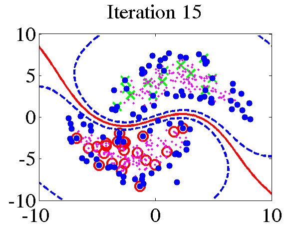
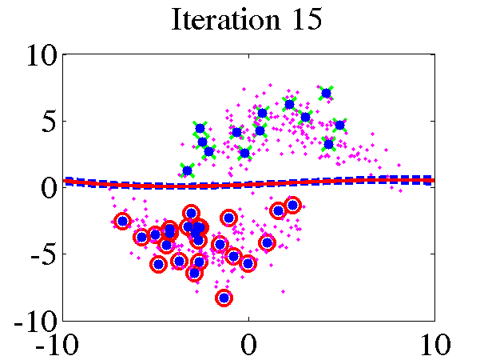

NCNM Software
=============

Note that there is a C++ version of the NCNM available within the IVM
C++ toolbox available [here](/ivmcpp/).

### Release Information

Current release is 0.11.

There are several other toolboxes you need to download and have in your
path these are:

| **Toolbox**                          | **Version**                         |
|--------------------------------------|-------------------------------------|
| [IVM](/ivm/downloadFiles/)           | 0.33                                |
| [KERN](/kern/downloadFiles/)         |  0.141                              |
| [NOISE](/noise/downloadFiles/)       |  0.13                               |
| [NDLUTIL](/ndlutil/downloadFiles/)   |  0.141                              |
| [OPTIMI](/optimi/downloadFiles/)     |  0.13                               |
| [PRIOR](/prior/downloadFiles/)       |  0.13                               |
| [DATASETS](/datasets/downloadFiles/) |  0.1                                |

Finally you will also need the [NETLAB
toolbox](http://www.aston.ac.uk/eas/research/groups/ncrg/resources/netlab/) in your path and
Anton Schwaighofer's SVM light MATLAB interface, available
[here](/svml_toolbox.html) to run the
`demThreeFive` example which compares with [SVMlight](http://svmlight.joachims.org/) version 5.00.

Examples
--------

The toy data example in the papers can be recreated using:

```matlab 
>> demUnlabelled1
```

and leads to the decision boundary given below. A standard IVM based
classifier can be run on the data using

```matlab
>> dem
```

\
 The null category noise model run on toy data. *Left*: using the null
category, the true nature of the decision boundary is recovered.
*Right*: the standard Gaussian process, does not recover the true
decision boundary.
The other USPS digit classification example given in the NIPS paper can
be re-run with:

```matlab 
>> demThreeFive
```

Be aware that this code can take some time to run. The results, in the
form of averaged area under ROC curve against probability of missing
label, can be plotted using

```matlab
>> demThreeFiveResults
```
Plot of average area under ROC curve against probability of label being
present. The red line is the standard IVM based classifier, the blue
dotted line is the null category noise model based classifier, the green
dash-dot line is the a normal SVM and the mauve dashed line is the
transductive SVM.


Page last modified on Fri Jan 5 12:47:39 GMT 2007.
